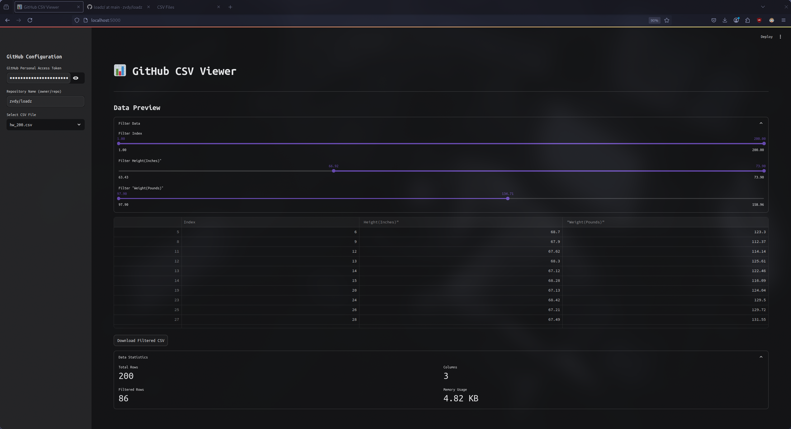

# GitHub CSV Viewer

A Streamlit app that connects to GitHub, retrieves CSV files from a private repository, udilizing [github personal access tokens](https://docs.github.com/en/authentication/keeping-your-account-and-data-secure/managing-your-personal-access-tokens).



## Features

- Data filtering
- Easy export
- Useful csv insights
- Ease of use
- Quick setup
- Minimalistic UI

# Dependencies

All dependencies are listed in [pyproject.toml](pyproject.toml)

## Installation 

1. Clone the repository

    ```bash
    git clone https://github.com/zvdy/py-git-csv-analysis

    cd py-git-csv-analysis
    ```

2.  Start a python [virtual environment](https://docs.python.org/3/library/venv.html) 

    ```
    python3 -m venv venv

    source venv/bin/activate
    ```


3. Install dependencies

    ```bash
    pip install -e .
    ```

4. Run the `streamlit` project

    ```bash
    streamlit run main.py
    ```

4. Insert your `github_PAT` and repository `username/repo` and navigate through all `.csv` files.
